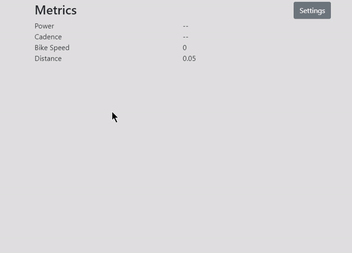

# Cycle Trainer

## Smart Connected Bluetooth Cycle Trainer App

### Environment

This is running a custom Bluetooth LE service I created in C++ for Windows 10 (source currently unavailable), the service automatically connects to a smart trainer and emits metrics to `stdout`. The front end of this app is built in `React` and `Electron` and spawns this service and listens to it, rendering the metrics.